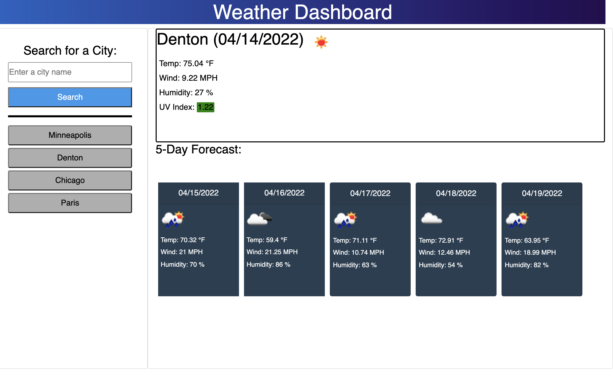

# Weather Dashboard

---

Weather dashboard uses the OpenWeatherMap API to get weather data from a city of your choice. It displays current weather including a color coded UV index. There is also a 5 day weather forecast provided.
​
## User Interface

## Usage
Enter a city name to retrieve the current and 5 day weather conditions. Every city you enter will be save in a list so you can select it again with having to re-enter the name. Your city list is save for future sessions. You can hit enter to submit the city, you don't have to use the mouse.

## Links to website and Github
[Weather Dashboard website](https://bagl0025.github.io/weather_dashboard)

[Github Repository](https://github.com/bagl0025/weather_dashboard.git)

## Author
Brian Bagley

April 2022
